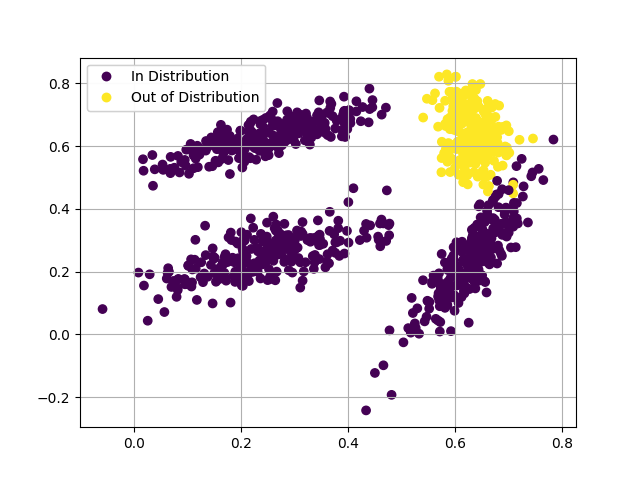

# MLP Experiments

Looking into depth and width of networks in classification. Adding in CCU work taking from https://github.com/AlexMeinke/certified-certain-uncertainty, and incorporating quantization from torch. 

**Preview of CCU convergence during training and base classifier on the two moons data set**

### Multi Class Convergence

**The Data**

Standard MLP 

CCU with the base classifier condition next to it.

